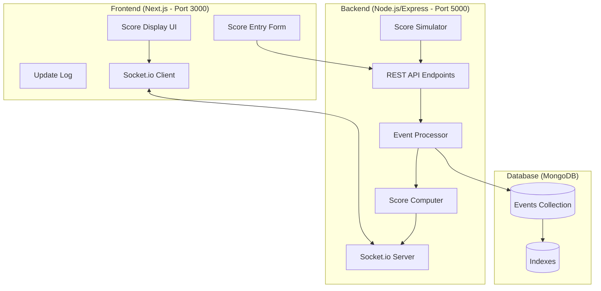
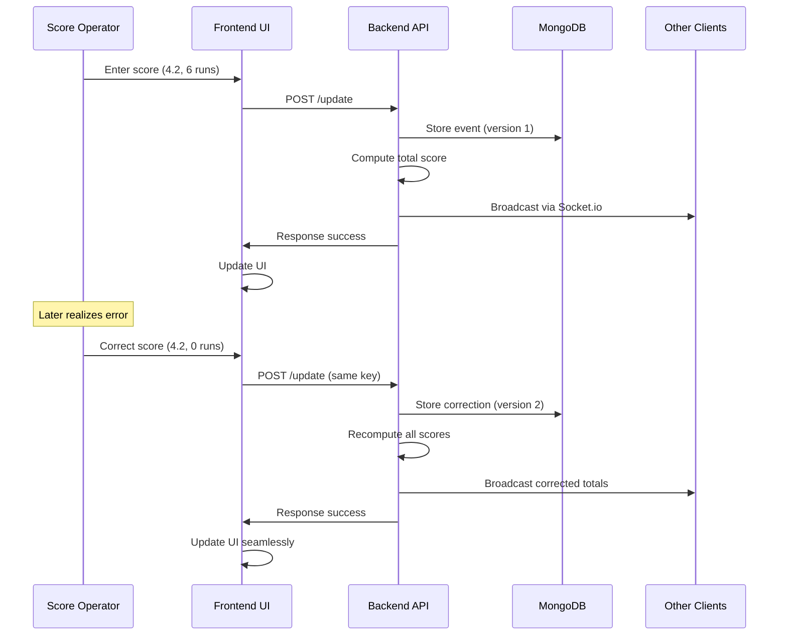

# Design Document

## Overview

The live cricket score tracking application implements an event-sourced architecture to handle real-time score updates and late-arriving corrections. The system consists of a Next.js frontend, Node.js/Express backend, MongoDB for event storage, and Socket.io for real-time communication. The core innovation is treating each ball as an immutable event with correction capabilities, allowing seamless updates without disrupting the user experience.

## Architecture

### High-Level Architecture



### Event Sourcing Pattern

The system implements event sourcing where:
- Each ball delivery is stored as an immutable event
- Corrections create new events with version increments
- Current state is computed by replaying all events
- Historical data is preserved for audit purposes

### Real-Time Communication Flow



## Components and Interfaces

### Frontend Components (Next.js)

#### 1. Main Page Component (`app/page.jsx`)
- **Purpose**: Root component managing the entire cricket score interface
- **State Management**: 
  - Current score (runs, wickets, overs)
  - Update log array
  - Socket connection status
  - Form input values
- **Socket.io Integration**: Connects to backend, joins match room, handles real-time updates

#### 2. Score Display Component
- **Purpose**: Shows current match status
- **Display Format**: "Team: X/Y in Z.B overs"
- **Real-time Updates**: Automatically updates when new events arrive

#### 3. Score Entry Form Component
- **Purpose**: Manual score entry interface
- **Fields**: Over (number), Ball (1-6), Runs (0-6), Wicket (checkbox), MatchId (text)
- **Validation**: Client-side validation with immediate feedback

#### 4. Update Log Component
- **Purpose**: Chronological display of recent score events
- **Features**: 
  - Shows last 20 events
  - Highlights corrections with special styling
  - Displays timestamp, over.ball, runs, wicket status

#### 5. Simulation Control Component
- **Purpose**: Trigger automated score simulation
- **Features**: Button to start simulation, progress indicator

### Backend Components (Node.js/Express)

#### 1. Express Server (`app.js`)
- **Purpose**: Main server setup with middleware and route configuration
- **Middleware**: CORS, JSON parsing, error handling
- **Socket.io Integration**: HTTP server wrapper for Socket.io

#### 2. Event Controller
- **Purpose**: Handle score update requests
- **Endpoints**:
  - `POST /update`: Process score events
  - `GET /simulate`: Trigger score simulation
- **Validation**: Input validation and sanitization

#### 3. Event Processor Service
- **Purpose**: Core business logic for event handling
- **Functions**:
  - `processEvent(eventData)`: Store and process new events
  - `handleCorrection(eventData)`: Manage correction logic
  - `validateEvent(eventData)`: Input validation

#### 4. Score Computer Service
- **Purpose**: Calculate current match state from events
- **Functions**:
  - `computeScore(matchId)`: Calculate total runs, wickets, current over
  - `getEventsByMatch(matchId)`: Retrieve and sort events
  - `aggregateStats(events)`: Compute statistics

#### 5. Socket Manager Service
- **Purpose**: Manage real-time communication
- **Functions**:
  - `broadcastScore(matchId, scoreData)`: Send updates to match room
  - `joinMatchRoom(socket, matchId)`: Handle client connections
  - `handleDisconnection(socket)`: Cleanup on disconnect

#### 6. Score Simulator Service
- **Purpose**: Generate automated score sequences for demonstration
- **Functions**:
  - `generateSequence()`: Create predefined score sequence
  - `sendEvent(eventData)`: Submit events with delays
  - `handleRetry(eventData)`: Retry failed submissions

## Data Models

### MongoDB Schema

#### Events Collection Schema

```javascript
{
  _id: ObjectId,
  key: String,           // "over.ball" format (e.g., "4.2")
  matchId: String,       // Match identifier (default: "default")
  over: Number,          // Over number (1, 2, 3, ...)
  ball: Number,          // Ball number (1-6)
  runs: Number,          // Runs scored (0-6)
  wicket: Boolean,       // Whether wicket fell
  timestamp: Date,       // When event was recorded
  eventType: String,     // "new" | "correction"
  version: Number,       // Version for audit trail
  previousData: {        // Only for corrections
    runs: Number,
    wicket: Boolean
  },
  enteredBy: String      // User identifier for auditing
}
```

#### Database Indexes

```javascript
// Compound index for efficient querying
{ matchId: 1, key: 1 }

// Index for time-based queries
{ matchId: 1, timestamp: 1 }

// Index for over-based queries
{ matchId: 1, over: 1, ball: 1 }
```

### API Data Models

#### Score Update Request
```javascript
{
  over: Number,          // Required: Over number
  ball: Number,          // Required: Ball number (1-6)
  runs: Number,          // Required: Runs scored (0-6)
  wicket: Boolean,       // Required: Wicket status
  matchId: String        // Optional: Match ID (default: "default")
}
```

#### Score Update Response
```javascript
{
  success: Boolean,
  message: String,
  data: {
    eventStored: Boolean,
    isCorrection: Boolean,
    currentScore: {
      runs: Number,
      wickets: Number,
      overs: String      // Format: "4.5"
    }
  }
}
```

#### Socket.io Event Data
```javascript
{
  matchId: String,
  score: {
    runs: Number,
    wickets: Number,
    overs: String
  },
  lastEvent: {
    over: Number,
    ball: Number,
    runs: Number,
    wicket: Boolean,
    isCorrection: Boolean
  },
  timestamp: Date
}
```

## Error Handling

### Frontend Error Handling

1. **Network Errors**: Display user-friendly messages for connection issues
2. **Validation Errors**: Show inline validation messages on form fields
3. **Socket Disconnection**: Show connection status and attempt reconnection
4. **API Errors**: Display server error messages with retry options

### Backend Error Handling

1. **Database Errors**: Log errors and return appropriate HTTP status codes
2. **Validation Errors**: Return 400 Bad Request with detailed error messages
3. **Socket Errors**: Handle client disconnections gracefully
4. **Simulation Errors**: Implement retry logic with exponential backoff

### Error Response Format

```javascript
{
  success: false,
  error: {
    code: String,        // Error code (e.g., "VALIDATION_ERROR")
    message: String,     // User-friendly message
    details: Object      // Additional error details
  }
}
```

## Testing Strategy

### Unit Testing

#### Frontend Tests
- Component rendering and state management
- Socket.io event handling
- Form validation logic
- Score display formatting

#### Backend Tests
- Event processing logic
- Score computation accuracy
- Database operations
- API endpoint responses

### Integration Testing

#### API Integration Tests
- End-to-end score submission flow
- Correction handling workflow
- Socket.io real-time updates
- Database consistency checks

#### Database Integration Tests
- Event storage and retrieval
- Index performance
- Concurrent access handling
- Data integrity constraints

### End-to-End Testing

#### Demonstration Scenario Tests
1. **Normal Flow**: Submit scores 4.1 through 5.1
2. **Error Introduction**: Submit incorrect score at 4.2
3. **Correction Flow**: Correct 4.2 after 4.5 and verify propagation
4. **Multi-Client**: Verify synchronization across multiple browser tabs

#### Performance Tests
- Socket.io broadcast latency (target: <100ms)
- Database query performance with large event sets
- Concurrent user handling
- Memory usage during long-running sessions

### Testing Tools and Framework

- **Frontend**: Jest, React Testing Library, Socket.io Mock
- **Backend**: Jest, Supertest, MongoDB Memory Server
- **E2E**: Playwright or Cypress for browser automation
- **Load Testing**: Artillery or k6 for performance testing

## Security Considerations

### Input Validation
- Sanitize all user inputs on both client and server
- Validate numeric ranges (over > 0, ball 1-6, runs 0-6)
- Prevent injection attacks in matchId field

### Rate Limiting
- Implement rate limiting on API endpoints
- Prevent spam submissions from single clients
- Monitor for unusual activity patterns

### Data Integrity
- Use MongoDB transactions for critical operations
- Implement optimistic locking for concurrent updates
- Validate event sequences for logical consistency

### Socket.io Security
- Implement proper CORS configuration
- Validate client connections and room access
- Monitor for excessive socket connections

## Performance Optimization

### Database Optimization
- Efficient indexing strategy for common queries
- Connection pooling for concurrent access
- Query optimization for score computation

### Real-time Performance
- Minimize Socket.io payload size
- Implement client-side caching for static data
- Use compression for large data transfers

### Frontend Optimization
- Implement virtual scrolling for long update logs
- Debounce form inputs to reduce API calls
- Use React.memo for component optimization

### Caching Strategy
- Cache computed scores for frequently accessed matches
- Implement Redis for session management if needed
- Use browser caching for static assets